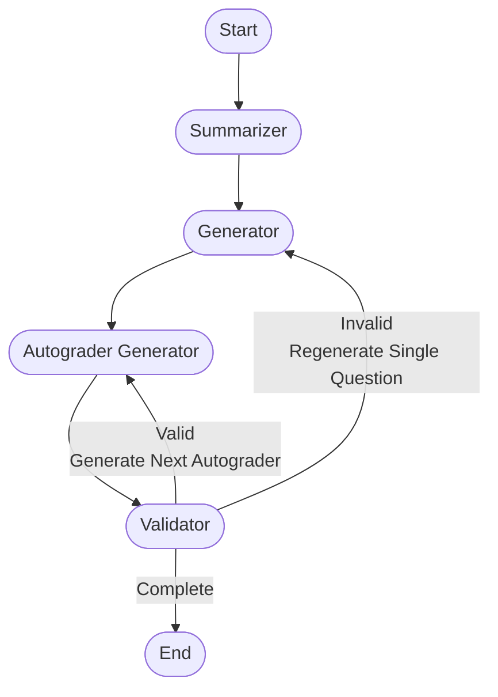

# AI study guide

## Week 4 - 5: Create the quiz generating system
Agents explained:
- **Summarizer**: Summarizes the notes and extracts topics for quiz generation. (maybe also research, if we can implement it)
- **Generator**: Generates a list of questions based on the topics provided by the summarizer.
- **Autograder generator**: Creates autograders for code questions. Makes no actions if the question is MCQ.
- **Validator**:  Validates the generated questions. For code questions, it runs the autograder script to check if example codes, inputs, and outputs match. For MCQs, it checks if the question is valid and if the options are correct. It sets the `__next__` and updates the `curr_question_valid` flag to control the workflow
### State dict for the system
```Python
class Question(TypedDict):
    # The title of the question, generated by quiz generator
    title: str
    # The context or description of the question, generated by quiz generator
    context: str
    # A list of topics related to the question, generated by quiz generator
    topics: list[str]
    # The type of the question, either "mcq" (multiple choice) or "code", generated by quiz generator
    question_type: Literal["mcq", "code"]

class MCQ(Question):
    # A list of options for the multiple-choice question, generated by quiz generator
    options: list[str]
    # The correct option for the multiple-choice question, generated by quiz generator
    correct_option: str

class CodeQuestion(Question):
    # The sample code provided for the coding question, generated by quiz generator
    sample_code: str
    # The autograder script to evaluate the coding question, generated by autograder generator
    autograder_script: str
    # A list of sample input-output pairs for the coding question, generated by quiz generator
    sample_input_output: list[tuple[str, str]]

class State(TypedDict):
    # A list of questions, which can be either MCQ or CodeQuestion
    questions: list[Union[MCQ, CodeQuestion]]
    # The total number of questions to be generated, provided by the user
    num_questions: int
    # The index of the current question being processed, starting from 0, updated within the validator
    current_index: int
    # A list of topics to be used for generating questions, generated by the summarizer or the user
    topics: list[str]
    # A flag indicating whether the current question is valid, set within the validator
    curr_question_valid: bool
    # A list of messages, annotated with the add_messages function
    messages: Annotated[list, add_messages]
    # The next state or node in the graph, only used within the validator
    __next__: str
```

### Workflow of the multi-agent system
